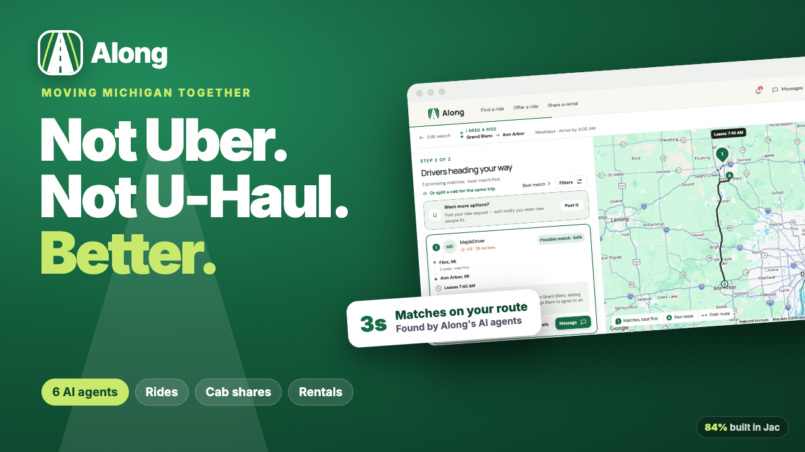

# Along — Moving Michigan together



**Along** matches you with people already going your way across Michigan, so you can **find a ride, offer your empty seats, split a cab, or share a rental car**, even a moving truck. A team of AI agents does the matching, and the app is private and anonymous by default.

> **Not Uber. Not U-Haul. Better.**

Built with **[Jac](https://www.jaseci.org/)**: about **84% of the codebase** is Jac (backend, agents and frontend).

---

## Features

- **Plain-English trip planning.** Type *"Grand Blanc to Ann Arbor by 9 every weekday"* and the Gemini-powered Trip Assistant fills in the whole journey: places, arrive-by or leave-at time, commute or one-time trip, seats, vehicle, and preferences like *"women only"* or *"I don't drive"*.
- **Find a ride, or split a cab.** One page, and one tap switches between riding with a driver and sharing a taxi or Uber fare.
- **Offer a ride.** Drivers see riders along their route, ranked by how little detour each one adds.
- **Share a rental.** Real rental counters near your pickup and your drop-off (Google Places), vehicles chosen by cargo space, and an *"I need someone to drive"* option.
- **Two-ride trips.** If nobody drives your whole route, Along chains two drivers and picks a safe, public handoff spot.
- **Post a request.** Searches are private until you post one. After that you get a notification the moment someone fitting posts.
- **Trust and safety.**
  - Anonymous handles, with real names revealed only when both people agree.
  - Age and gender preferences, matched both ways.
  - Share your trip with a friend, report, block, or remove a match.
  - Anonymous ratings you can edit later.
- **Real maps.** Road routes, place search and geocoding from the Google Maps Platform.
- **Installable** as a phone app (PWA).

## The agents

Every journey is a **node in one shared graph**. Each agent is a Jac **walker** with a single job, and they run as a pipeline:

| Agent | What it does |
|---|---|
| **Trip Assistant** (Gemini) | Turns a sentence into a structured journey, with a rule-based fallback |
| **Route Scout** | Keeps only journeys heading your way: same direction, small detour |
| **Schedule Agent** | Scores timing from your side: closest first, and a bit early beats a bit late |
| **Trust Agent** | Weighs ratings, reviews and travel preferences |
| **Cost Agent** | Estimates what each match saves |
| **Coordinator** | Ranks everything and **learns** its weights from which matches people actually choose |

Two helpers extend the pipeline:
- The **Relay Agent** builds two-ride trips. Gemini picks the handoff spot from real places nearby.
- The **Matchmaker** sends notifications when a newly posted journey fits yours.

Trips are filtered before they're scored. A trip must head the same way, stay within a sensible detour, fit the time window, and satisfy both people's preferences. A high score never rescues an irrelevant trip.

## Tech stack

- **Jac / Jaseci:** `jaclang`, `jac-client` (React UI in `.cl.jac`, Vite, PWA) and `jac-scale` (login, JWT, MongoDB storage)
- **MongoDB Atlas** for the data
- **Google Maps Platform:** Maps JS, Routes, Places (New) and Geocoding
- **Google Gemini** for the trip assistant and handoff-spot choice
- Deployed on **Jac Hammer**

## Getting started

### Prerequisites
- Python 3.12+ (developed on 3.14)
- A MongoDB Atlas connection string, or leave it out to use local storage
- Optional: a Google Maps API key and a Gemini API key

### 1. Install
```bash
git clone https://github.com/shivanisopariwala1008-creator/along.git
cd along
python3 -m venv .venv
source .venv/bin/activate
pip install -r requirements.txt
```

### 2. Configure
Create a `.env` file in the project root. **Never commit it.**
```bash
MONGODB_URI=mongodb+srv://<user>:<password>@<cluster>/   # optional; local storage without it
JWT_SECRET=<any long random string>
GOOGLE_MAPS_API_KEY=<key>   # optional; maps, routes, place search, rental counters
GEMINI_API_KEY=<key>        # optional; the trip assistant falls back to a rule-based reader
```

### 3. Run
```bash
set -a && source .env && set +a
jac start --dev main.jac
```
Open **http://localhost:8000**.

### 4. Load demo data (optional)
With the server running, in a second terminal:
```bash
jac run scripts/seed_test_users.jac
```
This creates **18 test accounts** plus about **370 sample journeys across 20 Michigan cities**: commutes, airport and train-station cab shares, moves and road trips.

- Every test account uses the password `AlongTest123!`.
- For example: `marcus.test@example.com`, `priya.test@example.com`, `dana.test@example.com`.

### Try these searches
| Try | What you'll see |
|---|---|
| `Grand Blanc to Ann Arbor by 9 every weekday` | Drivers on your route, ranked by timing |
| `Brighton to Dearborn, leaving 7:30 every weekday` | A **two-ride** trip with a handoff spot |
| `Ann Arbor to DTW Friday 6pm`, then choose *Split a cab* | Cab shares to the airport |
| `Driving Lansing to Detroit tomorrow at 7:30, 2 seats free` | Riders along your route |
| `Renting an SUV from Detroit to Traverse City next Friday, 2 of us` | Rental partners and counters |

## Project structure

```
main.jac                    # app entry: routes and the endpoints the UI uses
services/
  along.jac                 # graph model: nodes, edges, walkers (agents), endpoint signatures
  along.impl.jac            # agent logic, scoring, matching, relays, assistant, safety
  demo_network.jac          # generator for the ~370 sample journeys
  narrate.jac               # optional AI match explanations
  console_emailer.jac       # dev email sender (logs emails)
components/along/*.cl.jac   # the UI: forms, results and map, chat, profile, rating…
lib/along.cl.jac            # shared client helpers (formatting, labels)
scripts/seed_test_users.jac # test accounts, conversations and ratings
styles/along.css            # styles
jac.toml                    # project, plugin and PWA configuration
```

## Useful commands

```bash
jac check main.jac                  # type-check
jac start --dev main.jac            # dev server with hot reload
jac build main.jac --client pwa     # production build
jac guide                           # Jac reference guides
```

## Roadmap
- Real ID and email verification
- Cost splitting and payments for shared rides and rentals
- A pilot on the Flint ↔ Ann Arbor commuter corridor
- Native mobile builds and live trip tracking
-  Youtube link https://youtu.be/p3qugJZ2TTw

---

**Along — Michigan, moving together.**
